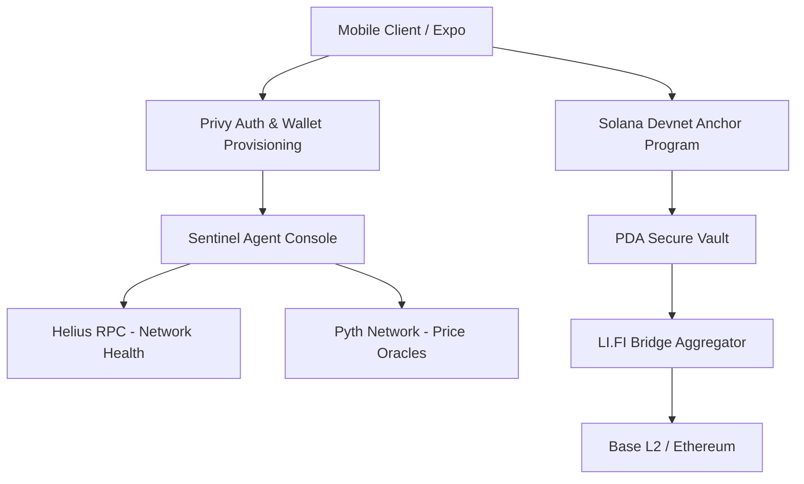

# Eject.fi: Autonomous Cross-Chain Capital Rescue Protocol

**A Solana-First application leveraging LI.FI to provide embedded, one-click cross-chain exits (Safe Haven) during DeFi emergencies.**

## 🏆 LI.FI Hackathon Qualification Profile

This section explicitly outlines how Eject.fi meets the LI.FI bounty qualification requirements:

*   **Project Name**: Eject.fi
*   **Short Description**: An autonomous security protocol that uses AI agents to monitor Solana network health and provides users with a one-click "Emergency Eject" button to instantly rescue and bridge their capital from Solana to a secure L2 (like Base) using LI.FI.
*   **A Clear User Problem**: During DeFi exploits or severe network congestion, users struggle to manually unstake, swap, and bridge their assets to safety. Eject.fi solves the **"Exit Friction"** problem by bundling withdrawal and cross-chain bridging into a single, seamless flow.
*   **Solana as a Core Part of the Journey**: The user's primary capital is stored in a non-custodial Solana Anchor Smart Contract (PDA Vault). Solana is the source execution layer.
*   **Meaningful LI.FI Integration (REST API/SDK)**: Eject.fi does not just mention LI.FI cosmetically. The "Safe Haven" feature relies entirely on the **LI.FI REST API / SDK** to calculate the fastest extraction route out of Solana. It generates real quotes and constructs the bridging payload that is bundled into the emergency withdrawal transaction.
*   **Product Idea & User Flow**: 
    1. User deposits funds into the Solana PDA Vault via the mobile app.
    2. Sentinel Agents continuously monitor Solana's TPS and DeFi oracle prices.
    3. If risk is high, the user presses "Emergency ZK-Eject" or "Safe Haven".
    4. The app queries LI.FI for the fastest bridge route from Solana.
    5. The user signs one transaction via Privy Embedded Wallet to authorize the Anchor withdrawal and the LI.FI bridge simultaneously.

---

## Abstract

Eject.fi is an institutional-grade, autonomous capital extraction protocol designed to mitigate the risks associated with decentralized finance (DeFi) exploits and sudden network congestion. By leveraging a mobile-first architecture integrated with an intelligent on-chain agent swarm, Eject.fi provides users with a one-click "Emergency Eject" mechanism. When initiated, the protocol bypasses standard congested frontends, interacts directly with a secure Solana Program Derived Address (PDA) vault, and seamlessly bridges assets to secure Layer 2 networks using **LI.FI optimized cross-chain routing**.

---

## Table of Contents

1. [Architectural Overview](#architectural-overview)
2. [Infrastructure & Technology Stack](#infrastructure--technology-stack)
3. [Sentinel Agent Swarm Architecture](#sentinel-agent-swarm-architecture)
4. [Smart Contract Specifications](#smart-contract-specifications)
5. [Embedded Wallet & Authentication (Privy)](#embedded-wallet--authentication-privy)
6. [Cross-Chain Escrow & Routing (LI.FI)](#cross-chain-escrow--routing-lifi)
7. [Network Analytics & Oracles (Helius & Pyth)](#network-analytics--oracles-helius--pyth)
8. [Codebase Navigation & Implementation Details](#codebase-navigation--implementation-details)
9. [Installation & Developer Guide](#installation--developer-guide)
10. [Future Roadmap](#future-roadmap)

---

## Architectural Overview

Eject.fi operates on a highly decoupled, reactive architecture. The primary objective is to eliminate the latency between vulnerability detection and capital extraction.



The system relies on a continuous monitoring loop where the "Sentinel" agents evaluate network conditions. If a threshold is breached, the user is prompted to execute an emergency withdrawal.

---

## Infrastructure & Technology Stack

The protocol leverages best-in-class Web3 infrastructure to guarantee uptime and execution speed during critical network events.

*   **Execution Layer**: Solana (Devnet for current staging, Mainnet-Beta ready)
*   **Authentication & Wallet Management**: Privy (Embedded Solana Wallets)
*   **Smart Contract Framework**: Anchor (Rust)
*   **Network Intelligence**: Helius (RPC & Digital Asset Standard APIs)
*   **Price Feeds**: Pyth Network
*   **Cross-Chain Routing**: **LI.FI Protocol (REST API)**
*   **AI Agent Monetization**: **x402 Protocol Standard**
*   **Frontend Framework**: React Native (Expo)

---

## 🤖 x402 Protocol: AI Agent Monetization (BONUS TRACK)

Eject.fi proudly implements the **x402 standard** to solve the economic alignment problem between decentralized AI agents and users. 

Deep infrastructure scans and continuous MEV-shielded monitoring require significant compute. Instead of relying on centralized subscriptions, Eject.fi agents reject initial heavy-compute requests with an **HTTP 402 (Payment Required)** equivalent. 

The client automatically parses this invoice, constructs a Solana transaction containing the micro-payment (e.g., 0.05 SOL) to the Sentinel Treasury, and tags it using the **Memo Program**. Once the agent verifies the cryptographic proof (the signature), the service is unlocked.

*File Reference: `src/utils/x402.ts`*

```typescript
// Excerpt: x402 Verification Flow
const transaction = new Transaction().add(
  SystemProgram.transfer({
    fromPubkey: userPubkey,
    toPubkey: invoice.treasury,
    lamports: invoice.amountSol * 1e9,
  })
);

// Tagging with memo program for agent verification
transaction.add(
  new TransactionInstruction({
    keys: [{ pubkey: userPubkey, isSigner: true, isWritable: true }],
    data: Buffer.from(`x402:${invoice.serviceRef}`, 'utf-8'),
    programId: new PublicKey('MemoSq4gqABAXKb96qnH8TysNcWxMyWCqXgDLGmfcHr'),
  })
);
```

---

## Sentinel Agent Swarm Architecture

The Sentinel system is not a monolithic backend service but rather a decentralized, multi-agent swarm running continuous heuristics on incoming block data. 

### Agent Responsibilities

1.  **Network Health Agent**: Polls the Helius RPC to calculate real-time Transactions Per Second (TPS).
2.  **Oracle Agent**: Subscribes to Pyth Network feeds to calculate volatile portfolio drawdowns.
3.  **Routing Agent (Powered by LI.FI)**: Pre-calculates the most gas-efficient and fastest cross-chain routes using the **LI.FI API**. This ensures that when the "Eject" command is triggered, the route is already resolved.
4.  **Execution Agent**: Constructs the final Solana transaction instruction, fetches the latest blockhash, and prepares it for signing by the user's embedded wallet.

---

## Smart Contract Specifications

Eject.fi utilizes Solana's Program Derived Addresses (PDAs) to generate deterministic, non-custodial vaults uniquely tied to the user's public key. The Anchor program acts as the sole authority capable of signing transactions on behalf of the vault.

*File Reference: `src/utils/solana.ts`*

```typescript
// Excerpt from PDA Derivation
export const getVaultPDA = (userPubkey: PublicKey) => {
  return PublicKey.findProgramAddressSync(
    [Buffer.from('vault'), userPubkey.toBuffer()],
    PROGRAM_ID
  );
};
```

---

## Embedded Wallet & Authentication (Privy)

To achieve a "Web2-like" user experience without sacrificing Web3 security, Eject.fi utilizes Privy for authentication and key management, allowing users to seamlessly interact with Solana contracts and sign LI.FI bridging payloads without seed phrases.

*File Reference: `src/hooks/useWallet.ts`*

---

## Cross-Chain Escrow & Routing (LI.FI)

When the primary Solana network is deemed compromised, extracting capital to a wallet on the same network is insufficient. Eject.fi integrates the **LI.FI REST API** to immediately route extracted capital to designated "Safe Haven" networks, primarily Ethereum Layer 2s like Base or Arbitrum.

### Exact Integration Method

Eject.fi uses the **LI.FI REST API / SDK integration path** because it requires granular control over backend transaction bundling. We cannot use a pre-built widget because the LI.FI bridge transaction must be executed seamlessly *immediately after* the Solana Anchor Vault withdrawal succeeds, requiring headless execution.

### Routing Logic & Code Proof

The application queries the LI.FI advanced routing API, specifying the source chain (Solana), the destination chain (Base), and the asset. The API returns the optimal call data for the bridging transaction.

*File Reference: `src/hooks/useChat.ts` (Agent Execution Logic)*

```typescript
// Excerpt: Requesting optimal route from LI.FI API for Safe Haven extraction
const getSafeHavenRoute = async (amount: string, userAddress: string) => {
  const response = await fetch('https://li.quest/v1/advanced/routes', {
    method: 'POST',
    headers: { 'Content-Type': 'application/json' },
    body: JSON.stringify({
      fromChainId: 1151111081099710, // Solana
      toChainId: 8453, // Base L2
      fromTokenAddress: 'So11111111111111111111111111111111111111112', // SOL
      toTokenAddress: '0x833589fCD6eDb6E08f4c7C32D4f71b54bdA02913', // USDC on Base
      fromAmount: amount,
      options: {
        order: 'RECOMMENDED',
        slippage: 0.03 // Allow for high slippage during emergencies
      }
    })
  });

  const data = await response.json();
  return data.routes[0]; // Return the fastest execution path
};
```

*Data Flow Representation:*
1. User requests "Safe Haven" extraction from the Dashboard.
2. App requests `/v1/advanced/routes` from LI.FI API (as shown above).
3. App parses the `transactionRequest` and optimal route.
4. App submits the unified transaction via the Privy Embedded Wallet.

*UI Evidence: The Dashboard features a prominent "Safe Haven" action card proudly displaying the official LI.FI branding, indicating the cross-chain rescue route is armed and ready.*

---

## Network Analytics & Oracles (Helius & Pyth)

Eject.fi relies on Helius to bypass standard rate limits during high-congestion events, ensuring the `emergency_eject` transaction is prioritized. It uses Pyth Network's hermes architecture for sub-second price updates.

---

## Codebase Navigation & Implementation Details

For auditors and developers reviewing this repository:

*   **`/src/screens/ChatScreen.tsx`**: The primary dashboard interface aggregating network status. Features the "Safe Haven" UI component powered by LI.FI.
*   **`/src/components/ActionGrid.tsx`**: Contains the specific implementation of the LI.FI branded action cards in compliance with LI.FI brand guidelines.
*   **`/src/hooks/useWallet.ts`**: The cryptographic engine handling Privy authentication and seamless transaction signing for both Anchor withdrawals and LI.FI cross-chain calls.
*   **`/src/utils/solana.ts`**: Contains the Anchor program interface.

---

## Installation & Developer Guide

### Environment Configuration

Create a `.env` file in the root directory.

```env
# Privy Authentication
EXPO_PUBLIC_PRIVY_APP_ID=your_privy_app_id
EXPO_PUBLIC_PRIVY_CLIENT_ID=your_privy_client_id

# Helius RPC
EXPO_PUBLIC_HELIUS_API_KEY=your_helius_api_key
EXPO_PUBLIC_SOLANA_RPC=https://devnet.helius-rpc.com/?api-key=your_helius_api_key
```

### Build and Execution

1.  Execute `npm install`.
2.  Execute `npx expo start -c`.
3.  Launch via Expo Go on a physical device.

---

## Future Roadmap

1.  **LI.FI Agentic Integration**: Transitioning route discovery entirely to an autonomous on-chain AI agent capable of finding liquidity dynamically without frontend interaction.
2.  **x402 Microtransactions**: Compensating the decentralized Sentinel agent network.
3.  **Institutional Multi-Sig**: Expanding PDA architecture for corporate treasuries.
